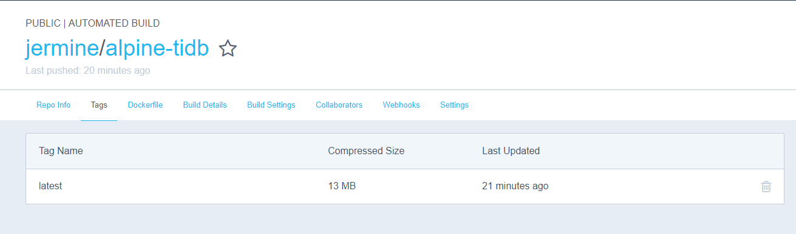

# alpine-tidb
This image is a tidb for alpine linux，the purpose is to make a  minimal edition for tidb images ！It`s only 12M !  So perfect！
[Click here](http://hub.daocloud.io/repos/103b217d-8a9d-47f0-bfe6-39bb07d5b66b) or [here](https://hub.docker.com/r/jermine/alpine-tidb/tags/) learn more info about images.
## The screenshots
### [Daocloud](http://hub.daocloud.io/repos/103b217d-8a9d-47f0-bfe6-39bb07d5b66b)

### [HubDocker](https://hub.docker.com/r/jermine/alpine-tidb/tags/)
